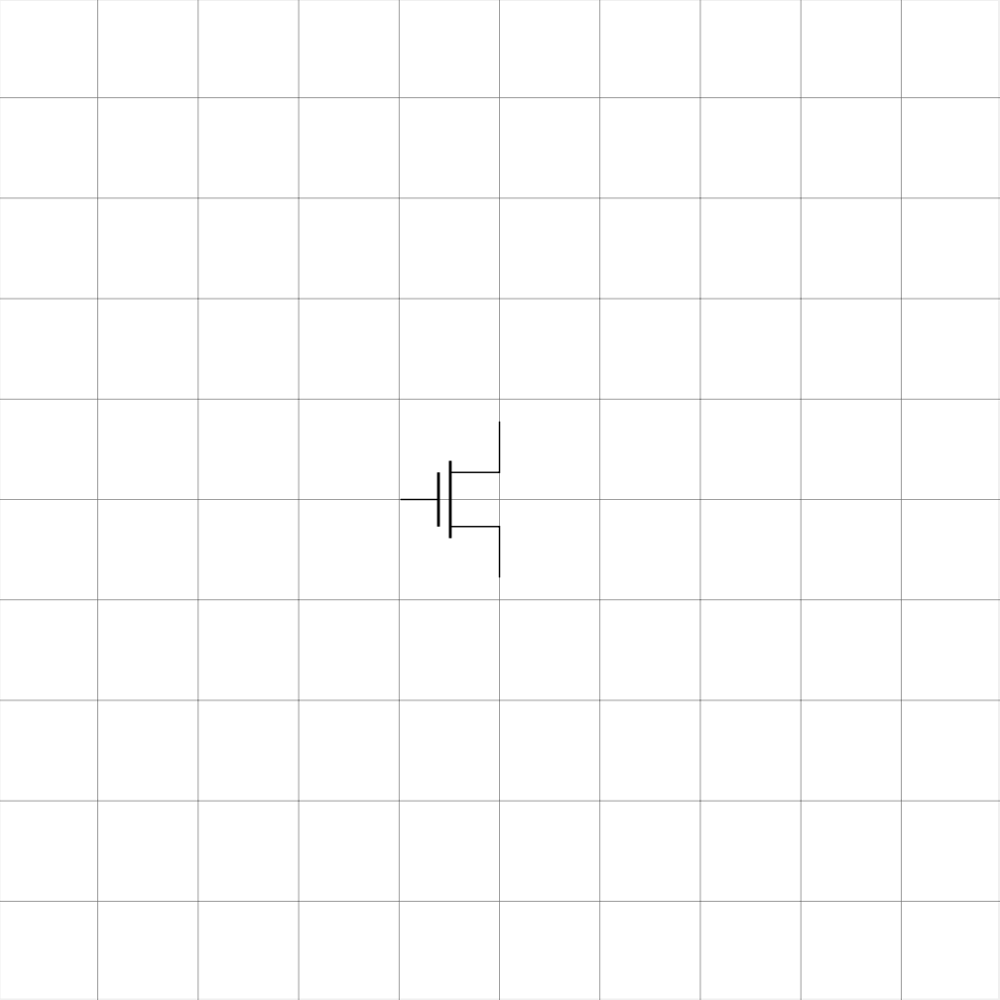

# iced circuitikz gui
---

A simple gui to help draw circuitikz elements with customization options. Note, this is not a useful tool to develop entire diagrams. However, when used in combination with TexText and Inkscape... in could become something useful... let's see.

Also a way to learn some rust...

## To Do
- [ ] add options for transistors
- [ ] more elements

## Example output 

  

